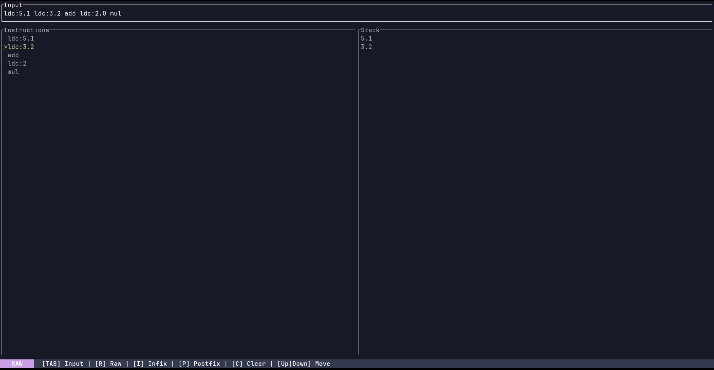

# stackalc

**stackalc** is a terminal-based stack calculator that lets you write mathematical expressions and see how they 
translate into a minimal, CIL-inspired instruction set. Whether you're experimenting with infix notation, exploring 
postfix (Reverse Polish Notation), or writing stack instructions directly, `stackalc` gives you a clear view of how 
expressions are broken down and executed step-by-step.

It features a clean, responsive terminal UI (TUI) built with [`ratatui`](https://github.com/ratatui/ratatui), 
showing both the list of generated instructions and the state of the stack at every stage of execution. This makes it 
ideal for learning how stack-based execution works under the hood.



---

## How to use

You start by pressing `TAB` and entering an expression or instruction sequence in one of the supported modes, then just
hit `ENTER` to calculate. 

**stackalc** will parse and convert that input into a sequence of stack-based operations. These instructions are then 
shown in a scrollable view, and you can step through them to observe how the virtual stack changes with each one.

---

## Input modes

There are three input modes available:

- `INFIX` mode is what most people are used to: expressions like `3 + 4 * 2` are supported, including parentheses 
and operator precedence.

- `POSTFIX` mode uses Reverse Polish Notation (RPN), where operators come after the operands. 
For example, `3 4 2 * +` is equivalent to the infix version above.

- `RAW` mode lets you write stack instructions manually. It's intended for directly inputting the instructions yourself.

---

## Instruction Set

The core of `stackalc` is its simple yet expressive instruction set, modeled after CIL operations. It supports basic 
arithmetic, comparisons, and stack manipulation:

- ``ldc:<value>`` pushes a constant floating-point number onto the stack.
- ``neg`` negates the top value on the stack.
- ``add`` pops the top two values, adds them, and pushes the result.
- ``sub`` pops the top two values, subtracts the second-from-top from the top, and pushes the result.
- ``mul`` pops the top two values, multiplies them, and pushes the result.
- ``div`` pops the top two values, divides the second-from-top by the top, and pushes the result.
- ``ceq`` compares the top two values for equality and pushes `1` if they're equal, `0` otherwise.
- ``cgt`` checks if the second-from-top is greater than the top value and pushes `1` if true, `0` otherwise.
- ``clt`` checks if the second-from-top is less than the top value and pushes `1` if true, `0` otherwise.
- ``dup`` duplicates the top value on the stack.
- ``pop`` removes the top value from the stack.

These instructions operate over a single stack, using the usual top-down execution model: binary operations consume two 
values (top-most and the one just below it), and unary ones like `NEG` or `POP` operate only on the top.

---

### Build

```bash
git clone https://github.com/Ikken9/stackalc.git
cd stackalc
cargo build --release
```