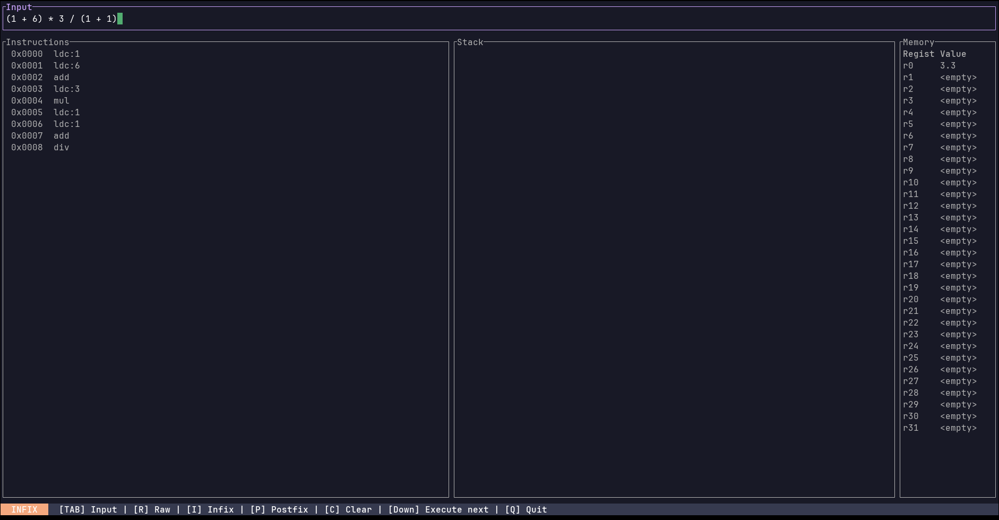
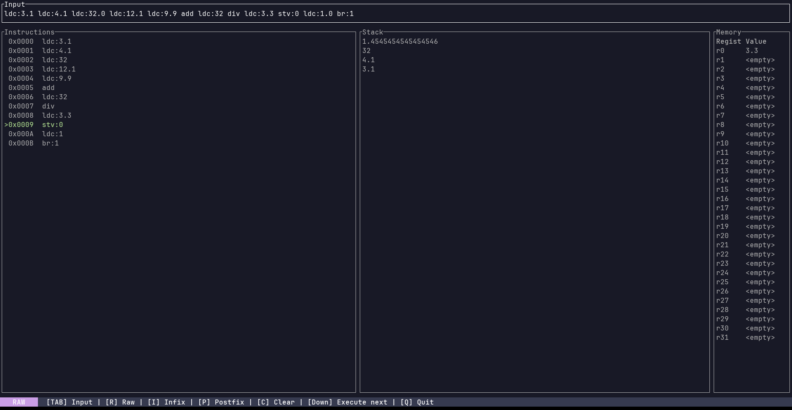

# stackalc

**stackalc** is a terminal-based stack calculator that lets you write mathematical expressions and see how they
translate into a minimal, CIL-inspired instruction set. Whether you're experimenting with infix notation, exploring
postfix (Reverse Polish Notation), or writing stack instructions directly, `stackalc` gives you a clear view of how
expressions are broken down and executed step-by-step.

It features a clean, responsive terminal UI (TUI) built with [`ratatui`](https://github.com/ratatui/ratatui),
showing a list containing the generated instructions, the state of the stack at every stage of execution and a memory
table that shows the values contained on the 32 registers. This makes it ideal for learning how stack-based execution
works under the hood.





---

## How to Use

Press `TAB` to switch into input mode and type an expression or a sequence of instructions, depending on the selected mode.
When you're ready, press `ENTER` to compile and execute your input.
You can press `Q` at any time to quit.

**stackalc** will parse your input and generate a list of stack-based operations.
These instructions are displayed in a scrollable view, and you can step through them one by one using the `Down` arrow key
to see how the virtual stack evolves with each instruction.

---

## Input modes

There are three input modes available:

- `INFIX` mode is what most people are used to: expressions like `3 + 4 * 2` are supported, including parentheses
and operator precedence.

- `POSTFIX` mode uses Reverse Polish Notation (RPN), where operators come after the operands.
For example, `3 4 2 * +` is equivalent to the infix version above.

- `RAW` mode lets you write stack instructions manually. It's intended for directly inputting the instructions yourself.

---

## Instruction Set

The core of `stackalc` is its simple yet expressive instruction set, modeled after CIL operations. It supports basic
arithmetic, comparisons, and stack manipulation:

- ``ldc:<value>`` pushes a constant floating-point number onto the stack.
- ``ldv:<index>`` pushes the value of the specified register onto the stack.
- ``stv:<index>`` pops the top value from the stack and stores it into the specified register.
- ``neg`` negates the top value on the stack.
- ``add`` pops the top two values, adds them, and pushes the result.
- ``sub`` pops the top two values, subtracts the second-from-top from the top, and pushes the result.
- ``mul`` pops the top two values, multiplies them, and pushes the result.
- ``div`` pops the top two values, divides the second-from-top by the top, and pushes the result.
- ``ceq`` compares the top two values for equality and pushes `1` if they're equal, `0` otherwise.
- ``cgt`` checks if the second-from-top is greater than the top value and pushes `1` if true, `0` otherwise.
- ``clt`` checks if the second-from-top is less than the top value and pushes `1` if true, `0` otherwise.
- ``dup`` duplicates the top value on the stack.
- ``pop`` removes the top value from the stack.
- ``nop`` does nothing.
- ``rng`` pushes a random float between 0.0 and 1.0.
- ``br:<value>`` unconditionally jumps to the specified index.
- ``brtrue:<value>`` pops the top value; if it is non-zero, jumps to the specified index; otherwise, continues normal execution.
- ``brfalse:<value>`` pops the top value; if it is zero, jumps to the specified index; otherwise, continues normal execution.

---

### Build

```bash
git clone https://github.com/Ikken9/stackalc.git
cd stackalc
cargo build --release
```
